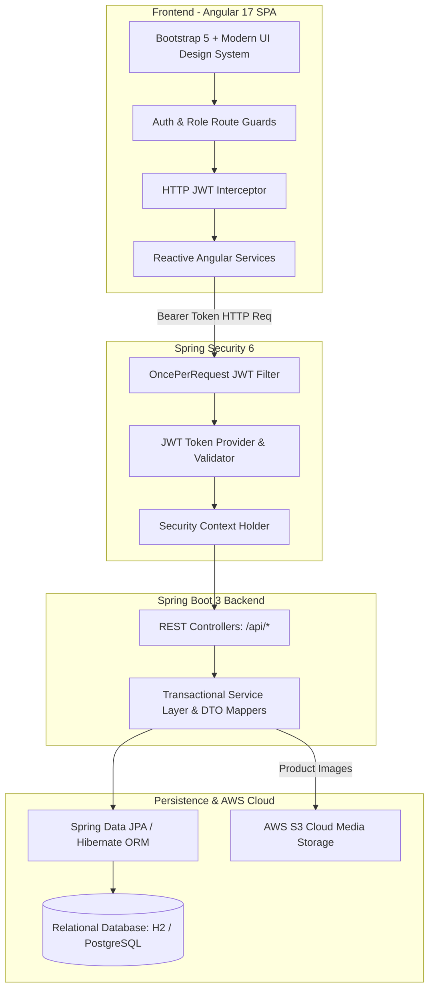
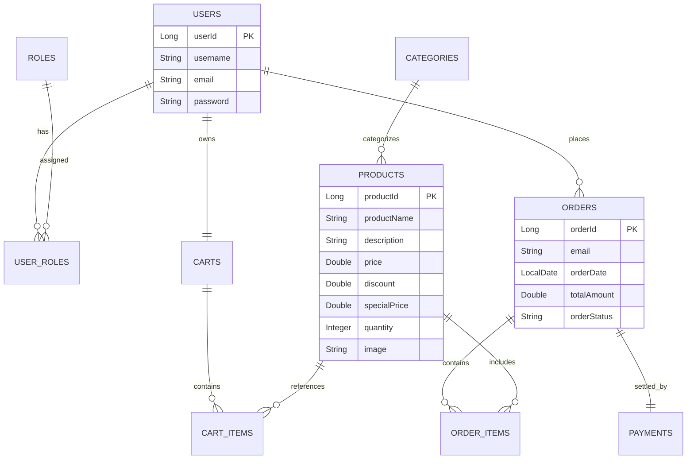

<div align="center">

# ☁️ CloudCart — Cloud-Native Enterprise E-Commerce Platform

[](https://www.oracle.com/java/)
[](https://spring.io/projects/spring-boot)
[](https://spring.io/projects/spring-security)
[](https://angular.io/)
[](https://aws.amazon.com/)
[](https://www.docker.com/)

<p align="center">
  <b>Enterprise Full-Stack E-Commerce Ecosystem Featuring Role-Based Access Control (RBAC), Stateless JWT Security, AWS S3 Media Ingestion, and High-Performance Angular SPA</b>
</p>

---


</div>

---

## 📌 Project Overview & Engineering Scope

**CloudCart** is an enterprise-grade full-stack e-commerce web platform engineered for reliability, security, and cloud scalability. 

Designed with a decoupled **Client-Server Architecture**, it pairs a high-performance **Spring Boot 3 RESTful API** backend with a modern **Angular 17 Single Page Application (SPA)** frontend. The system features stateless JWT authentication, multi-tier Role-Based Access Control (RBAC), end-to-end order lifecycle management, dynamic pagination, and cloud storage integration for product media.

---

## 🏛️ System Architecture



---

## 🗄️ Database Entity-Relationship (ER) Schema



---

## 📸 Platform Visual Showcase

<table align="center">
  <tr>
    <td align="center" width="50%">
      <b>🛍️ Product Discovery & Category Navigation</b><br><br>
      
    </td>
    <td align="center" width="50%">
      <b>🧺 Real-Time Cart & Quantity Manager</b><br><br>
      
    </td>
  </tr>
  <tr>
    <td align="center" width="50%">
      <b>💳 Order Checkout & Payment Summary</b><br><br>
      
    </td>
    <td align="center" width="50%">
      <b>📦 Track Orders & Shipment History</b><br><br>
      
    </td>
  </tr>
  <tr>
    <td align="center" width="50%">
      <b>🛠️ Admin Product & Inventory Dashboard</b><br><br>
      
    </td>
    <td align="center" width="50%">
      <b>➕ Admin Product Publishing Workflow</b><br><br>
      
    </td>
  </tr>
  <tr>
    <td align="center" width="50%">
      <b>🔐 Secure JWT User Login</b><br><br>
      
    </td>
    <td align="center" width="50%">
      <b>❤️ Wishlist & Saved Products</b><br><br>
      
    </td>
  </tr>
</table>

---

## ✨ Key Technical Capabilities

### 1. 🛡️ Enterprise Security & Multi-Role Authorization
- **Stateless JWT Flow**: Secure login generating signed JWT tokens with customizable expiration.
- **Spring Security 6 Filter Chain**: Custom `AuthTokenFilter` intercepts requests to populate `SecurityContextHolder`.
- **Role-Based Access Control (RBAC)**:
  - `ROLE_USER`: Browse catalog, manage personal cart, wishlist, and submit orders.
  - `ROLE_SELLER` / `ROLE_ADMIN`: Create, update, delete products, manage inventory stock, and update shipment statuses.

### 2. ⚡ Modern Angular 17 Architecture
- **Standalone Components & Reactive Signals**: Optimized change detection and modular component hierarchy.
- **HTTP Interceptors**: Centralized token injection (`Authorization: Bearer <JWT>`) and automated 401/403 redirection.
- **CanActivate Route Guards**: Protects customer and admin panels against unauthorized URL navigation.
- **Dynamic Catalog Controls**: Instant category pill navigation, page size selectors, and keyword search debounce.

### 3. 📦 Business Logic & Persistence Layer
- **Transactional Consistency**: Atomic operations for order placement, stock decrement, and cart clearing using Spring `@Transactional`.
- **Automated Price Computations**: Dynamic calculation of discount deductions and special pricing.
- **Pagination & Sorting**: Spring Data JPA `Pageable` support for memory-efficient query execution.

---

## 📂 Repository Structure

```text
Cloud-ecommerce-platform/
│
├── e-commerce-backend/                # Spring Boot 3 REST API Application
│   ├── src/main/java/com/app/
│   │   ├── config/                    # Security Filter Chain & ModelMapper Config
│   │   ├── controllers/               # REST Endpoints (Auth, Cart, Orders, Products)
│   │   ├── exceptions/                # Global API Exception Handlers
│   │   ├── models/                    # JPA Entities (User, Role, Product, Cart, Order)
│   │   ├── payloads/                  # Request/Response DTOs & Validation Schemas
│   │   ├── repositories/              # Spring Data JPA Data Access Interfaces
│   │   ├── security/                  # JWT Utils, EntryPoint & AuthTokenFilter
│   │   └── services/                  # Business Logic Services & Implementations
│   ├── src/main/resources/            # Application Properties & DB Profiles
│   └── pom.xml                        # Maven Dependencies & Plugins
│
├── e-commerce-frontend/               # Angular 17 Standalone Application
│   ├── src/app/
│   │   ├── auth/                      # Login & Registration Components
│   │   ├── cart/                      # Cart Management & Quantity Controls
│   │   ├── orders/                    # Order Tracking & Checkout Flow
│   │   ├── products/                  # Catalog, Product Creation & Admin Management
│   │   ├── services/                  # Angular HttpClient API Services
│   │   └── shared/                    # Header, Footer, Route Guards & Interceptors
│   ├── angular.json                   # Angular Workspace Configuration
│   └── package.json                   # Dependencies & Scripts
│
├── docs/screenshots/                  # Platform UI Visual Assets & Demonstrations
├── eCommerce.postman_collection.json  # Comprehensive Postman Test Collection
└── README.md                          # Platform Documentation
```

---

## 💽 REST API Endpoint Reference

| HTTP Method | Endpoint | Authorization | Description |
| :--- | :--- | :--- | :--- |
| `POST` | `/api/auth/signup` | Public | Register new user account |
| `POST` | `/api/auth/login` | Public | Authenticate credentials & return JWT |
| `GET` | `/api/public/products` | Public | Fetch paginated product catalog |
| `GET` | `/api/public/categories` | Public | Fetch all product categories |
| `POST` | `/api/admin/products` | Admin / Seller | Create and publish a new product |
| `PUT` | `/api/admin/products/{id}` | Admin / Seller | Update existing product details |
| `DELETE` | `/api/admin/products/{id}` | Admin | Remove product from inventory |
| `GET` | `/api/cart` | Authenticated | Retrieve current user's shopping cart |
| `POST` | `/api/cart/products/{id}` | Authenticated | Add product to cart |
| `DELETE` | `/api/cart/{productId}` | Authenticated | Remove product from cart |
| `POST` | `/api/orders` | Authenticated | Place order & initiate checkout |
| `GET` | `/api/orders/user` | Authenticated | Fetch current user order history |
| `PUT` | `/api/admin/orders/{id}/ship` | Admin | Update shipment status to Shipped |

---

## 🚀 Local Installation & Setup

### 1. Clone the Repository
```bash
git clone https://github.com/code-with-apoorv/Cloud-ecommerce-platform.git
cd Cloud-ecommerce-platform
```

### 2. Run the Spring Boot Backend
```bash
cd e-commerce-backend
./mvnw clean spring-boot:run
```
*The backend REST API will initialize on `http://localhost:8080`.*

### 3. Run the Angular Frontend
```bash
cd ../e-commerce-frontend
npm install
npm start
```
*The frontend web application will launch on `http://localhost:4200`.*

### 4. API Testing with Postman
Import `eCommerce.postman_collection.json` into Postman to test pre-configured endpoints with automated JWT token passing.

---

## 🎙️ Interview Highlights & Technical Discussion Points

1. **Why Angular + Spring Boot?**
   - *"I separated concerns between a stateless Spring Boot microservice/REST backend and an Angular SPA to allow independent scaling, clear API boundaries, and high reusability for mobile or third-party clients."*
2. **How is Security Handled?**
   - *"Authentication is implemented via Spring Security 6 using stateless JWT tokens. Outgoing Angular HTTP requests pass through an Interceptor that attaches the Bearer token, while the Spring filter chain validates the token signature and sets the SecurityContext on every request."*
3. **Database Performance & Transactions**:
   - *"All order operations use `@Transactional` to guarantee atomicity between cart clearing, stock reduction, and order generation. Product lists utilize Spring Data JPA `Pageable` to prevent memory bottlenecks."*

---

## 👨‍💻 Author
**Apoorv**  
- GitHub: [@code-with-apoorv](https://github.com/code-with-apoorv)  
- Repository: [Cloud-ecommerce-platform](https://github.com/code-with-apoorv/Cloud-ecommerce-platform)
