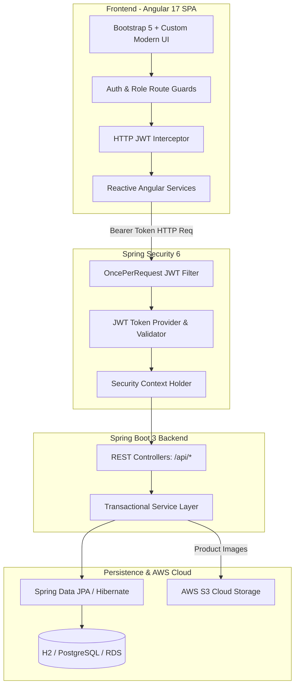
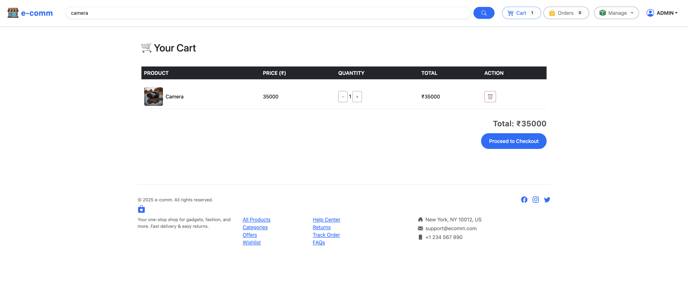

<div align="center">

# ☁️ CloudCart — Cloud-Native Enterprise E-Commerce Platform

[](https://www.oracle.com/java/)
[](https://spring.io/projects/spring-boot)
[](https://spring.io/projects/spring-security)
[](https://angular.io/)
[](https://aws.amazon.com/)
[](https://www.docker.com/)

<p align="center">
  <b>Full-Stack Microservice-Ready E-Commerce Ecosystem Featuring Role-Based Access Control (RBAC), JWT Authentication, S3 Media Ingestion, and High-Performance Angular SPA</b>
</p>

---


</div>

---

## 📌 Project Overview

**CloudCart** is an enterprise-grade full-stack e-commerce application designed to deliver scalable cloud shopping experiences. Built with a decoupled architecture utilizing a **Spring Boot 3 REST API backend** and an **Angular 17 single-page application (SPA)**, the platform supports multi-tier user authorization (Customers, Sellers, and Admins), end-to-end order tracking, instant cart checkout, and AWS cloud media hosting.

---

## 🏛️ System Architecture



---

## 📸 Platform Screenshots Showcase

<table align="center">
  <tr>
    <td align="center" width="50%">
      <b>🛍️ Product Discovery & Category Navigation</b><br><br>
      
    </td>
    <td align="center" width="50%">
      <b>🧺 Real-Time Cart & Quantity Manager</b><br><br>
      
    </td>
  </tr>
  <tr>
    <td align="center" width="50%">
      <b>💳 Order Checkout & Payment Summary</b><br><br>
      
    </td>
    <td align="center" width="50%">
      <b>📦 Track Orders & Shipment History</b><br><br>
      
    </td>
  </tr>
  <tr>
    <td align="center" width="50%">
      <b>🛠️ Admin Product & Inventory Dashboard</b><br><br>
      
    </td>
    <td align="center" width="50%">
      <b>➕ Admin Product Publishing Workflow</b><br><br>
      
    </td>
  </tr>
  <tr>
    <td align="center" width="50%">
      <b>🔐 Secure JWT User Login</b><br><br>
      
    </td>
    <td align="center" width="50%">
      <b>❤️ Wishlist & Saved Products</b><br><br>
      
    </td>
  </tr>
</table>

---

## ✨ Key Capabilities & Technical Features

### 1. 🛡️ Enterprise Security & Multi-Role Authorization
- Stateless **JWT (JSON Web Token)** authentication filter integrated with **Spring Security 6**.
- Role-Based Access Control (**RBAC**):
  - `ROLE_USER`: Browse catalog, manage personal cart, wishlist, and submit orders.
  - `ROLE_SELLER` / `ROLE_ADMIN`: Create, update, manage inventory levels, and mark order shipment milestones.

### 2. ⚡ Modern Frontend Experience (Angular 17)
- **Standalone Components & Signals** architecture with fast first load times.
- **HTTP Interceptors**: Automatically attaches JWT bearer authorization headers to outbound requests and centralizes error handling.
- **Route Guards**: Protects authenticated and administrative routes against unauthorized access.
- **Responsive Product Grid**: Dynamic category filtering, search debounce, and custom pagination controls.

### 3. 📦 Robust E-Commerce Business Logic
- **Inventory Control**: Real-time stock validation during checkout.
- **Discount & Special Price Calculation**: Automatic computation of discounted prices and percentage tags.
- **Cart & Wishlist Synchronization**: Seamless item persistence and instant checkout triggers.

---

## 📂 Project Structure

```text
Cloud-ecommerce-platform/
│
├── e-commerce-backend/                # Spring Boot 3 REST API Application
│   ├── src/main/java/com/app/
│   │   ├── config/                    # Spring Security & App Configuration
│   │   ├── controllers/               # REST API Endpoints (Auth, Cart, Orders, Products)
│   │   ├── exceptions/                # Global API Exception Handlers
│   │   ├── models/                    # JPA Entities (User, Role, Product, Cart, Order)
│   │   ├── payloads/                  # DTOs & API Request/Response Schemas
│   │   ├── repositories/              # Spring Data JPA Repository Interfaces
│   │   ├── security/                  # JWT Token Providers & Auth Filters
│   │   └── services/                  # Business Logic & Service Implementations
│   ├── src/main/resources/            # Application Properties & DB Profiles
│   └── pom.xml                        # Maven Dependencies & Build Configuration
│
├── e-commerce-frontend/               # Angular 17 SPA Application
│   ├── src/app/
│   │   ├── auth/                      # Login & Registration Components
│   │   ├── cart/                      # Cart Management & Item Quantity Controls
│   │   ├── orders/                    # Order Tracking & Checkout Modules
│   │   ├── products/                  # Catalog, Product Detail & Admin Management
│   │   ├── services/                  # HttpClient API Services
│   │   └── shared/                    # Header, Footer, Route Guards & Interceptors
│   ├── angular.json                   # Angular CLI Configuration
│   └── package.json                   # NPM Packages & Scripts
│
├── docs/screenshots/                  # Platform UI Visual Assets & Demonstrations
├── eCommerce.postman_collection.json  # Comprehensive Postman Test Collection
└── README.md                          # Platform Documentation
```

---

## 💽 REST API Endpoint Reference

| HTTP Method | Endpoint | Authorization | Description |
| :--- | :--- | :--- | :--- |
| `POST` | `/api/auth/signup` | Public | Register new user account |
| `POST` | `/api/auth/login` | Public | Authenticate credentials & generate JWT |
| `GET` | `/api/public/products` | Public | Fetch paginated product catalog |
| `GET` | `/api/public/categories` | Public | Fetch all available categories |
| `POST` | `/api/admin/products` | Admin / Seller | Create and publish a new product |
| `PUT` | `/api/admin/products/{id}` | Admin / Seller | Update existing product details |
| `DELETE` | `/api/admin/products/{id}` | Admin | Remove product from platform |
| `GET` | `/api/cart` | Authenticated | Retrieve current user cart items |
| `POST` | `/api/cart/products/{id}` | Authenticated | Add product to shopping cart |
| `DELETE` | `/api/cart/{productId}` | Authenticated | Remove item from shopping cart |
| `POST` | `/api/orders` | Authenticated | Submit order & initiate checkout |
| `GET` | `/api/orders/user` | Authenticated | Fetch purchase history for current user |
| `PUT` | `/api/admin/orders/{id}/ship` | Admin | Update shipment status to Shipped |

---

## 🚀 Local Installation & Setup

### 1. Clone the Repository
```bash
git clone https://github.com/code-with-apoorv/Cloud-ecommerce-platform.git
cd Cloud-ecommerce-platform
```

### 2. Run the Spring Boot Backend
```bash
cd e-commerce-backend
./mvnw clean spring-boot:run
```
*The backend REST API will initialize on `http://localhost:8080`.*

### 3. Run the Angular Frontend
```bash
cd ../e-commerce-frontend
npm install
npm start
```
*The frontend web application will launch on `http://localhost:4200`.*

---

## 🔮 Future Extensions
- [ ] **Payment Gateway Integration**: Stripe & Razorpay Webhook integration.
- [ ] **Elasticsearch Ingestion**: Sub-second full-text fuzzy product search.
- [ ] **Kafka Event Streaming**: Async notification dispatch for order updates.

---

## 👨‍💻 Author
**Apoorv**  
- GitHub: [@code-with-apoorv](https://github.com/code-with-apoorv)  
- Repository: [Cloud-ecommerce-platform](https://github.com/code-with-apoorv/Cloud-ecommerce-platform)
